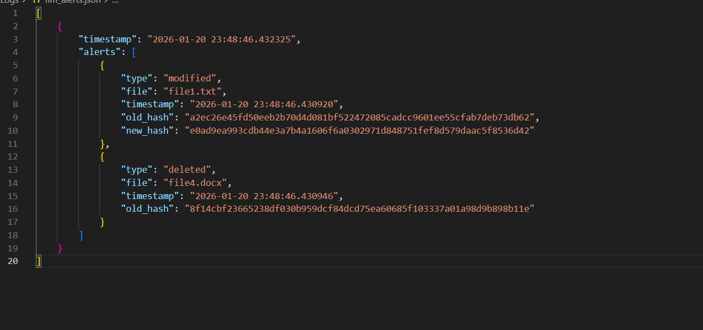
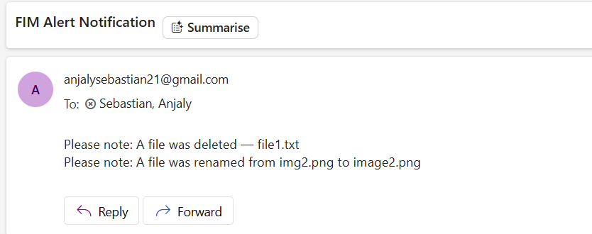

# Alert & Jira Integration

## Project Overview
This project extends a basic File Integrity Monitoring (FIM) system by adding an **alerting workflow**, **detailed change logging**, and **Jira incident preparation**.  
The script continuously monitors a folder, detects file changes, logs them, sends email alerts, and prepares a Jira-compatible payload.

---

## Task Requirements

### a. Trigger an alert when file integrity changes are detected
- Alerts include:
  - Console output  
  - JSON alert logs  
  - Email notifications (optional, via Gmail SMTP)

### b. Log detailed information about changed files
For each change, the script logs:
- Filename  
- Old hash  
- New hash  
- Timestamp  
- Change type (added, modified, deleted, renamed)

### c. Prepare data for Jira API
- A Jira incident payload is automatically generated.
- Includes:
  - Project key  
  - Summary  
  - Description (JSON-formatted alert details)  
  - Issue type  

---

## Folder Structure

```
├── Monitored_Files/              
├── Hash_Database/
│   └── file_hashes.json          
├── Logs/
│   ├── fim_changes.json          
│   └── fim_alerts.json           
├── .env                          
└── fim_monitor.py                
```

---

## Working

### 1. Monitoring & Hashing
- The script scans all files in `Monitored_Files/`.
- SHA-256 hashes are calculated for each file.
- Hashes are stored in `Hash_Database/file_hashes.json`.

### 2. Detecting File Changes
The script compares **old hashes** with **new hashes** and identifies:

| Change Type | Description |
|-------------|-------------|
| Added       | New file detected |
| Modified    | File content changed (hash mismatch) |
| Deleted     | File removed from folder |
| Renamed     | Same hash but different filename |

### 3. Logging Changes
All detected changes are appended to: `Logs/fim_changes.json`.


Each entry includes:
- Timestamp  
- Added files  
- Modified files  
- Deleted files  
- Renamed files  

### 4. Triggering Alerts
When changes occur, the script:

#### Prints alerts to console  
#### Logs alerts to `Logs/fim_alerts.json`  
#### Sends an email notification (if `.env` is configured)

Email includes:
- Added files  
- Modified files  
- Deleted files  
- Renamed files  

### 5. Jira Payload Preparation
A Jira incident payload is generated:

bash
```
jira_payload = {
        "fields": {
            "project": {"key": "FIM"},
            "summary": f"File Integrity Alert - {len(alerts)} change(s) detected",
            "description": json.dumps(alerts, indent=4),
            "issuetype": {"name": "Incident"}
        }
    }
```

This payload can be directly sent to Jira’s REST API.

---

## Alert Workflow

### 1. Detect File Changes
   - The integrity check identifies added, modified, deleted, or renamed files.
   - Old hashes and new hashes are compared to determine the type of change.

### 2. Build Alert Objects
   - For each detected change, an alert entry is created containing:
       • change type
       • filename (or old/new names for renames)
       • old hash (if applicable)
       • new hash (if applicable)
       • timestamp

### 3. Print Alerts to Console
   - Each alert is displayed in a readable JSON format for immediate visibility.

### 4. Log Alerts to JSON File
   - Alerts are appended to:
       Logs/fim_alerts.json
   - A timestamped record is stored for auditing and incident review.

     

### 5. Prepare Email Notification
   - A simplified message list is generated:
       • "A file was added — X"
       • "A file was modified — Y"
       • "A file was deleted — Z"
       • "A file was renamed from A to B"
   - If email credentials exist in .env:
       → An email alert is sent via Gmail SMTP.
     

### 6. Generate Jira Payload
   - A structured JSON payload is created containing:
       • project key
       • summary of number of changes
       • detailed alert description
       • issue type (Incident)
   - This payload is ready to be sent to the Jira REST API.

### 7. Continue Monitoring
   - The script waits 20 seconds.
   - The workflow repeats for the next integrity check cycle.

---
## .env Setup

### 1. Install Required Python Packages
   - The script uses python-dotenv for loading email credentials.
   - Install it using:
       pip install python-dotenv

### 2. Create the .env File
   - This file stores your email alert credentials securely.
   - Create a file named ".env" in the project root with the following content:

bash
```
       SENDER_EMAIL=your_email@gmail.com
       APP_PASSWORD=your_app_password
       RECEIVER_EMAIL=recipient_email@gmail.com
```
   - APP_PASSWORD is a Gmail App Password (not your real Gmail password).


---

## Summary

This enhanced FIM system:
- Monitors file integrity  
- Logs all changes  
- Generates alerts  
- Sends email notifications  
- Prepares Jira incident data  

It provides a complete workflow suitable for security monitoring, automation, and incident response.

---
