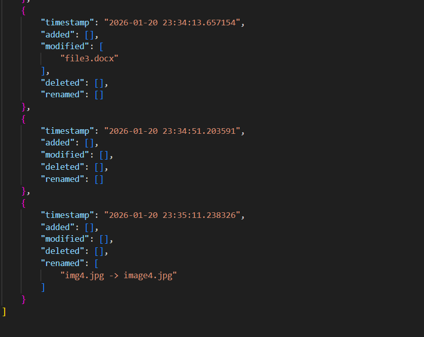

# Script to Calculate and Store File Hash Values

A Python-based File Integrity Monitoring tool that scans a specified folder, calculates SHA-256 hashes for all files, stores them in a JSON database, and logs any changes such as additions, modifications, deletions, or renames.

---

## 1.  Project Overview
This project implements a simple File Integrity Monitoring (FIM) system using Python.
It performs the following tasks:

 ### Task Requirements
- Iterates through all files in a specified folder
- Calculates the SHA-256 (or MD5 if needed) hash for each file
- Stores the filename + hash in a JSON file for later comparison
- Runs continuously and logs changes.

---

## 2. Project Folder Structure

```
├── Monitored_Files/            # Folder being monitored
├── Hash_Database/
│   └── file_hashes.json        # Stores filename + hash values
├── Logs/
│   └── fim_changes.json        # Stores change logs
└── fim_monitor2.py             # Main script

```
---

## 3. Working

### 1. Scanning the Monitored Folder
   - The script checks the folder defined in MONITORED_FOLDER (default: Monitored_Files/).
   - If the folder does not exist, it is automatically created.
   - All files inside the folder are listed and processed.

### 2. Calculating SHA-256 Hash Values
   - Each file is opened in binary mode.
   - The script reads the file in chunks (4096 bytes).
   - A SHA-256 hash is generated using Python’s hashlib module.
   - Errors such as missing files or permission issues are safely handled.

### 3. Loading Previous Hashes
   - The script checks if Hash_Database/file_hashes.json exists.
   - If the file is missing or corrupted, an empty hash database is used.
   - Old hashes are loaded into memory for comparison.

### 4. Storing New Hashes
   - After hashing all files, the script writes updated hash values to:
       Hash_Database/file_hashes.json
   - Each entry includes:
       - filename
       - SHA-256 hash
       - timestamp of last check

### 5. Detecting Changes
   - The script compares old hashes with new hashes to detect:
       • Added files
       • Modified files
       • Deleted files
       • Renamed files
   - A reverse lookup (hash → filename) helps detect renames.
     
### 6. Logging Detected Changes
   - All detected changes are appended to:
       Logs/fim_changes.json
   - Each log entry includes:
       - timestamp
       - added files
       - modified files
       - deleted files
       - renamed files
   - If the log file is corrupted, it is reset safely.

### 7. Continuous Monitoring Loop
   - The script runs inside a while True loop.
   - Every 20 seconds, it performs a new integrity check.
   - Any unexpected errors are caught and printed without stopping the script.



---

## 4. Summary

This project implements a simple File Integrity Monitoring (FIM) system using Python.  
The script continuously scans a specified folder, calculates SHA-256 hash values for all files, and compares them with previously stored hashes to detect any changes. It identifies added, modified, deleted, and renamed files, then logs these events in a JSON log file. All hash values are stored in a separate JSON database for future comparison. The script runs in a loop, performing integrity checks every 20 seconds, and includes robust error handling to ensure stable operation.

---
