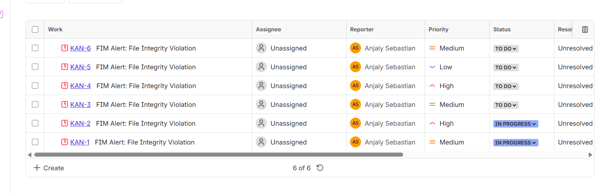

# Jira Incident Automation

This project implements an advanced File Integrity Monitoring (FIM) system that detects file changes, logs them, generates alerts, and automatically creates Jira incident tickets using Jira’s REST API.
The script continuously monitors a folder, compares file hashes and metadata, and triggers alerts whenever integrity violations occur.

---

## Features

- Continuous monitoring of a target folder
- SHA‑256 hashing for file integrity validation
- Metadata tracking (size, permissions, timestamps)
- Detection of:
    • Added files
    • Modified files
    • Deleted files
    • Permission changes
    • Size changes
    • Timestamp changes
- Alert generation with detailed change information
- Jira REST API integration (automatic incident creation)
- Priority assignment based on severity
- JSON logging of all changes and alerts
- Clean Jira payload export for auditing

---

## Folder Structure

```
├── Monitored_Files/
├── Hash_Database/
│   └── file_hashes.json
├── Logs/
│   ├── fim_changes.json
│   ├── fim_alerts.json
│   └── jira_payload.json
├── .env
└── project.py
```
---

## Working

1. The script scans all files inside `Monitored_Files/`.
2. For each file, it calculates:
     - SHA‑256 hash
     - Metadata (size, permissions, mtime, ctime)
3. Old hashes and metadata are loaded from `Hash_Database/file_hashes.json`.
4. The script compares old and new values to detect:
     • Added files
     • Modified files
     • Deleted files
     • Permission changes
     • Size changes
     • Timestamp changes
5. All detected changes are logged into:
     Logs/fim_changes.json
6. Alerts are generated and printed to console.
7. Alerts are saved into:
     Logs/fim_alerts.json
8. A clean Jira payload is generated and saved.
9. A Jira ticket is automatically created using REST API.
10. New hashes and metadata are saved for the next cycle.
11. The script repeats every 15 seconds.

---

## Alert Workflow

1. Detect file changes during integrity check.
2. Build alert messages for each change:
     • File Added
     • File Modified (old hash → new hash)
     • File Deleted
     • Permission Changed
     • Size Changed
     • Timestamp Changed
3. Print alerts to console.
4. Append alerts to Logs/fim_alerts.json.
5. Build a clean Jira payload and save it to Logs/jira_payload.json.
6. Determine priority:
     • High → deleted or permission changed
     • Medium → modified
     • Low → added
     • Lowest → no major change
7. Prepare Jira REST API payload (Atlassian Document Format).
8. Send POST request to Jira API endpoint.
9. Validate response:
     • 200/201 → ticket created successfully
     • Otherwise → print error details
10. Continue monitoring loop.



---

## Jira Payload 

bash
```
{
  "fields": {
    "project": {
      "key": "<PROJECT_KEY>"
    },
    "summary": "File Integrity Monitoring Alert",
    "description": "Alert 1\n\nAlert 2\n\nAlert 3",
    "issuetype": {
      "name": "Incident"
    }
  },
  "created_at": "2026-01-23 19:12:00"
}

```

---

## .env Configuration

Create a `.env` file in the project root:
bash
```
JIRA_EMAIL=your_email@example.com
JIRA_API_TOKEN=your_api_token
JIRA_URL=https://your-domain.atlassian.net/rest/api/3/issue
JIRA_PROJECT_KEY=your_key
```
### Notes:
 - JIRA_API_TOKEN must be generated from Atlassian account settings.
 - JIRA_URL must point to the issue creation endpoint.

---

## Summary

During testing, multiple file changes were performed manually inside the monitored folder:

• Added new files → detected successfully  
• Modified files → hash and metadata changes logged  
• Deleted files → alerts generated correctly  
• Permission changes → flagged as High priority  
• Jira tickets → created automatically for every change event  
• API responses → validated (HTTP 201 Created)

Improvements made:
• Added priority classification  
• Added metadata comparison  
• Added clean Jira payload export  
• Improved error handling for corrupted logs  
• Added validation for missing .env configuration  


---
