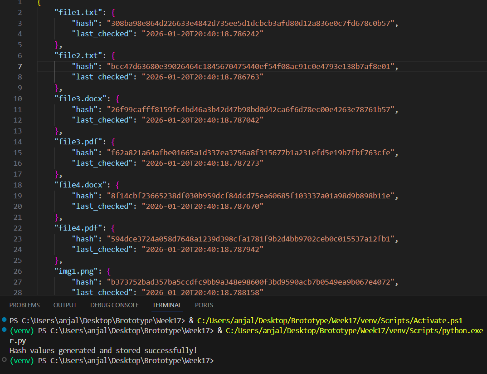

# File Integrity Monitoring (FIM) – Environment Setup & Project Documentation

This README documents the setup process, dependencies, folder structure, and preparation steps for the File Integrity Monitoring (FIM) automation project.  
It is designed to help users understand how to configure the environment before running the FIM script.

---

## 1. Install Python & Required Libraries

### Python Installation
Ensure that **Python 3.8 or higher** is installed on your system.

Check your Python version:

```bash
python --version

```

If Python is not installed, download it from:
• 	https://www.python.org/downloads/

### Required Libraries
This project uses Python’s built‑in standard libraries, so no external installations are required for basic functionality.
Libraries used:
- **os** – file and directory operations
- **hashlib** – hashing algorithm (SHA‑256)
- **json** – storing hash values
- **datetime** – timestamping
Optional (for future enhancements):
- **time** – delays or scheduling
- **requests** – API integrations (install with pip install requests)

## 2. Create the Project Folder Structure
Create a main project directory:

FIM_Project/

Inside it, create the following structure:
```
FIM_Project/
│
├── Monitored_Files/          # Folder containing files to monitor
├── Hash_Database/            # Stores file_hashes.json
└── fim_script.py             # Python script (your FIM automation code)
```
The script will automatically create missing folders, but preparing them manually ensures clarity.

## 3. Prepare a Test Directory for Monitoring
Inside the `Monitored_Files/` folder, add several sample files to test hashing:
```
Monitored_Files/
│
├── file1.txt
├── file2.log
├── file3.pdf
└── image.png
```
These files will be scanned, hashed, and stored in the JSON database.

## 4. What the Script Does (High‑Level Overview)

The FIM script performs the following core tasks:

### 1. Ensures Required Folders Exist
- Creates `Monitored_Files/`
- Creates `Hash_Database/`
- Creates `file_hashes.json` if it does not already exist

---

### 2. Calculates SHA‑256 Hashes
- Reads each file inside the `Monitored_Files/` directory  
- Generates a SHA‑256 hash for every file  
- Handles common errors such as:
  - Missing files  
  - Permission issues  

---

### 3. Stores Hashes in JSON

The script saves all generated hashes into a JSON file located at: `Hash_Database/file_hashes.json`


### 4. Prints a Success Message
Indicates that hashing is complete.

---

## 5. Summary
This documentation covers:
- Installing Python
- Preparing required libraries
- Creating the project folder structure
- Setting up a monitored directory
- Understanding the script’s purpose and workflow
- Adding screenshots for clarity
